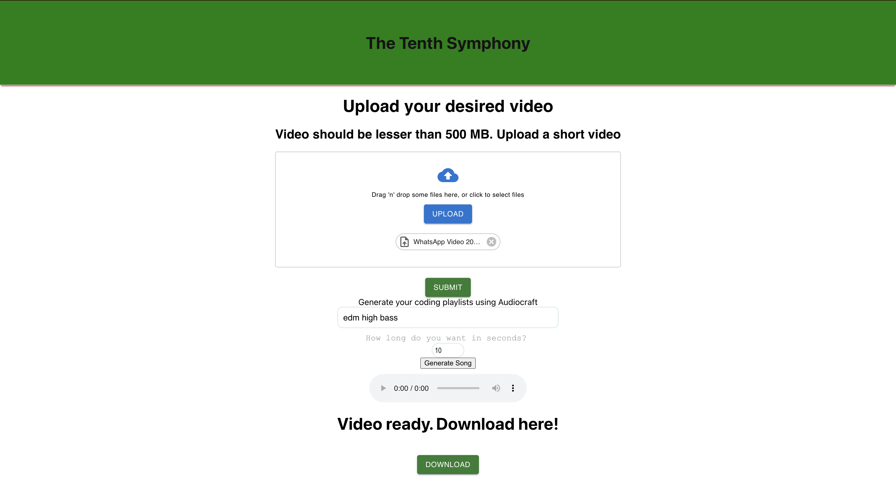
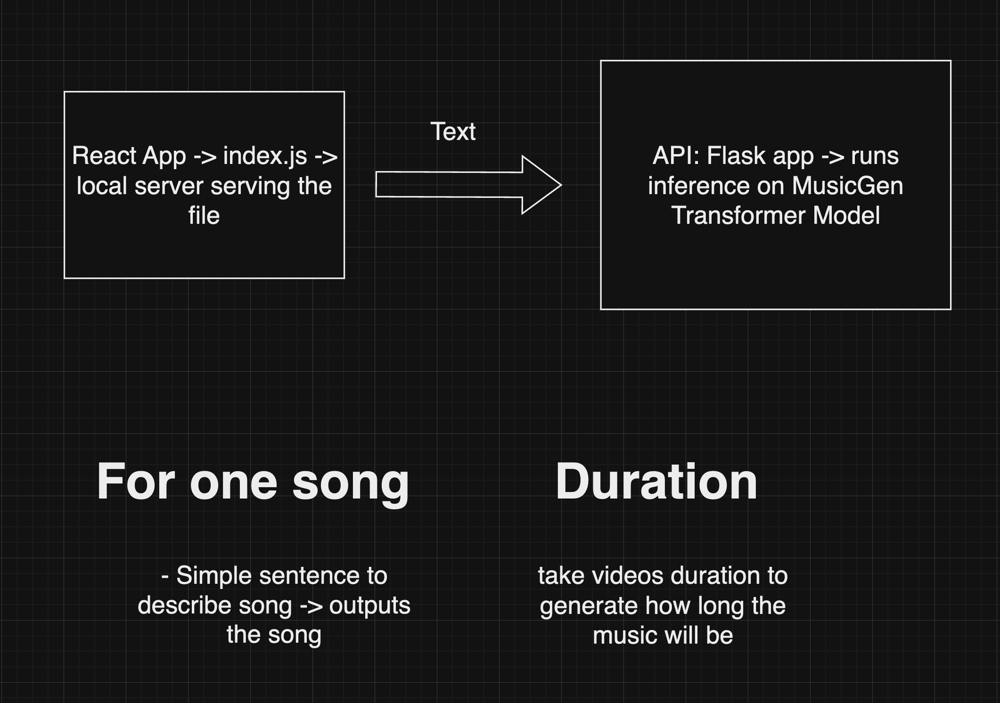
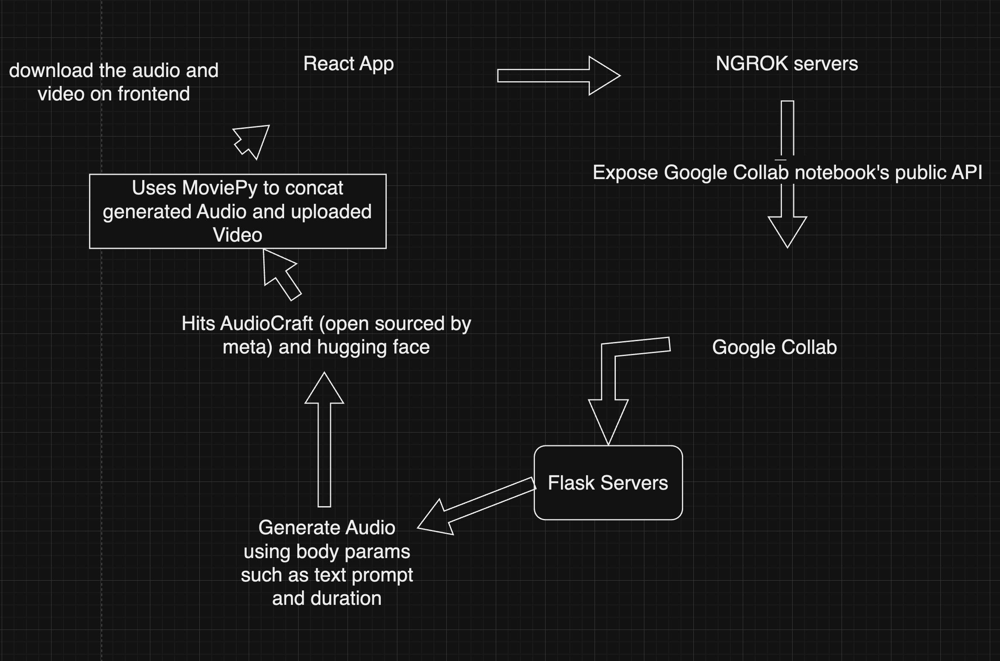
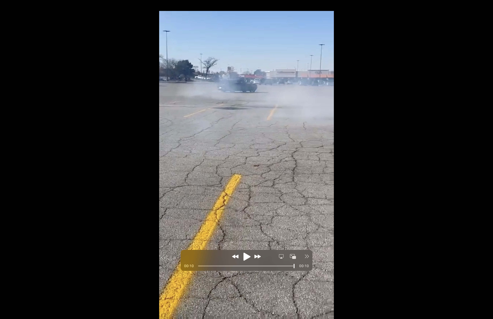

# tenth-symphony

Deep learning project for automatic music generation

https://trello.com/b/JVT4pjvT/the-tenth-symphony

# Components Used - Flask, ngrok, AudioCraft, HuggingFace, React

# AI Generated Music

A full stack web application where user can upload videos and get background music attached to it. It is an AI generated music so no copyright claims are there!

# dependencies used

1. express - framework
2. nodemon - node server
3. body-parser - body parsing in js
4. cors - cross origin errors
5. react - frontend framework
6. material-ui - react styled components
7. react-material-file-upload - react styled components
8. @mui/icons-material - react styled components
9. react-tinder-card - react styled components
10. flask - backend framework
11. pathlib - interact with filesystem
12. ffmpeg - audio handling
13. transformers - Autoprocessor
14. MusicGenForConditionalGeneration - For Music Generation from AI
15. flask-ngrok - expose public API for google collab
16. moviepy - to concat video and audio
17. flask_cors - handle cors errors
18. audioCraft by meta - facebook's state of the art music generation system

# Routes

1. / - GET
2. /upload - POST
3. /download - GET
4. /playlist_gen - POST
5. /static/<path:path> - GET

# setup

1. clone https://github.com/1709abhishek/TENTH-SYMPHONY
2. cd TENTH-SYMPHONY
3. run npm start to run frontend server
4. open google collab and run ipynb file there
5. login into ngrok and get auth token from there
6. run auth token and save header cell first
7. run cell by cell
8. server up and running
9. copy paste the ngrok link into your react handlers, you're all set!

# Project structure

.

    ├── requirements
        ├── Application of deep learning.pptx
    ├── .gitignore
    ├── tenth-symphony.ipynb
    ├── frontend
    │   ├── public
    │   ├── src
    |        ├── components
    |            ├── Download.js
    |            ├── Upload.js
                 ├── main.js
                 ├── App.js
    ├── Readme.md

# Routes and body Table

| Routes                | Request Body       | Method | Description                        | Response |
| --------------------- | ------------------ | ------ | ---------------------------------- | -------- |
| [/]                   | No                 | Get    | normal landing page                | Yes      |
| [/upload]             | (files)            | POST   | upload video                       | Yes      |
| [/download]           | No                 | GET    | download video                     | Yes      |
| [/playlist_gen]       | (prompt, duration) | POST   | enter prompt and duration of music | Yes      |
| [/static/<path:path>] | No                 | GET    | save audio                         | Yes      |

# Rap Lyric Generator Using Deep Learning and LLM models

## Introduction

This project aims to explore rap music and hip hop as genre. We took a dig on phonetics and rhyming scheme for the rap music and generate rap lyrics with the help of three models :-

1. distilgpt2-rap : hugging face link(https://huggingface.co/dzionek/distilgpt2-rap)
2. GPT2-finetuned-lyric-generation : hugging face link(https://huggingface.co/SpartanCinder/GPT2-finetuned-lyric-generation)
3. Ngrams - created by our own

We fine tune these models on our curated dataset collected from musicmatch api.

Then we compare and contrast above models based on different quantitative metrics.

## Objectives

- Data Collection and Preprocessing: Sourcing data from Musixmatch API, with preprocessing including grapheme-to-phoneme conversion. It contains around 30 artists with 50 songs each.
- Model Experimentation: The project involved Hyperparamter fine-tuning on train datasets on different models such as distilgpt2-rap, GPT2-finetuned and N-grams with phoneme-grapheme conversions.

## Model Training

- Training involved multiple sessions on Google Colab using Tesla V100 GPUs, utilizing the capability to reload from checkpoints for continuous training.
  https://drive.google.com/file/d/1JEK95SayQL8wMx6JAHpzOmzKd6GUsKW_/view?usp=sharing

## Deployment Architecture and Accessibility

Due to cost and resource limitations, we did not deploy the project yet. But look forward to do so in the future.

## Cost and Time Consideration

Balancing cost-efficiency and performance, the project's execution was done on Google Collab. Initially, everything was executed and fine tuned with smaller datasets on free tiers but later we purchased google collab pro and apparantly we burnt out all our computational resources, system ram and GPUs. Fine tuning on larger datasets is a computationally heavy and costly task.

## Evaluation and Future Improvements

- Lyric Quality: The model's ability to rhyme and maintain meter is an ongoing developmental focus. But We were able to produce decent results, and it is fine to produce non copyrighted music with the help of AI
- Future Research : Ongoing research and development on adding and auto tuning background music with AI so that it can be used as a copyright free music suite.

## Conclusion

This capstone project represents an ambitious foray into combining machine learning with artistic creativity. It demonstrates the challenges and potential of using natural language processing in the creative domain of Hip Hop lyricism.
